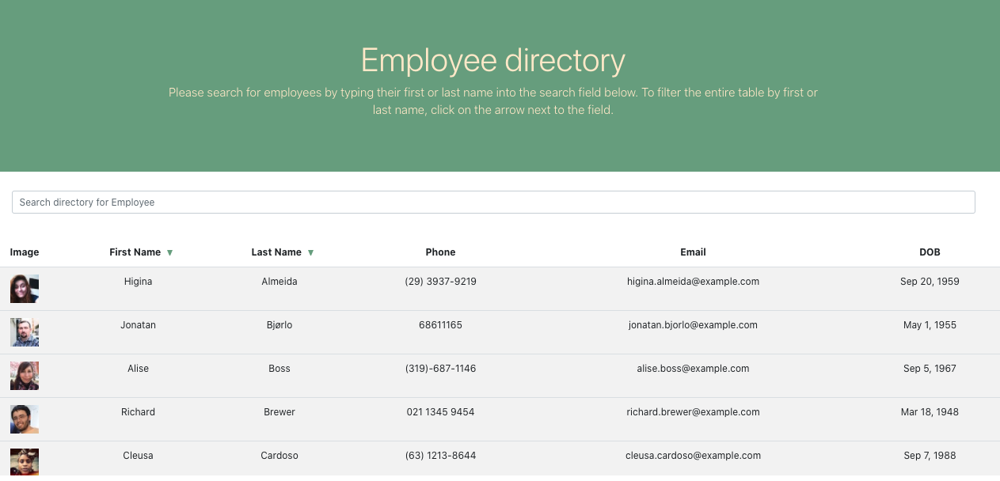

# Employee directory

This application offers a sample employee directory. The staff of 20 employees is displayed in a table along with a thumbnail photo of the employee and contact information. Users can search for an individual employee by either first or last name. They also can sort the entire table of employees by first or last name.

## Installation/Usage

To view this application, navigate to https://nmiller2379.github.io/company-directory/ in your browser. To run the application locally, clone the repo to your desktop and run "npm start" in your CLI.

## Technologies

This application was built using react. It also uses bootstrap and css for its front end. The sample employees come courtesy of an api call to https://randomuser.me/. An npm package, dateformat, provides the formatting on the employee's date of birth. The application uses axios to make the api call.
